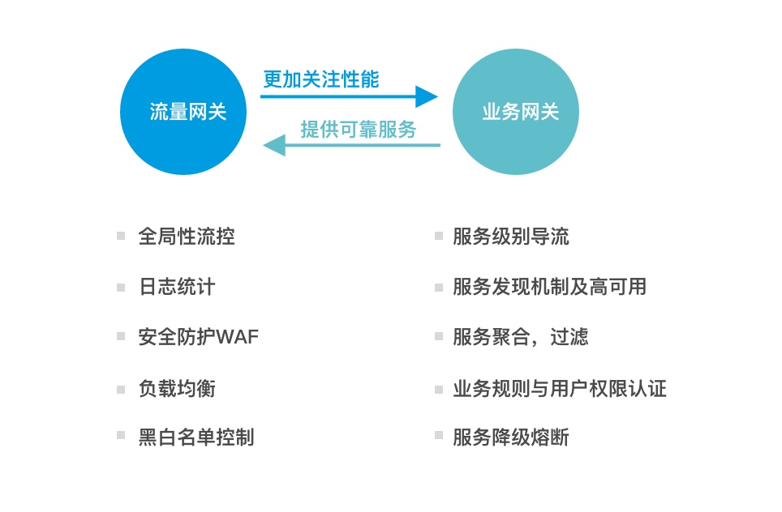
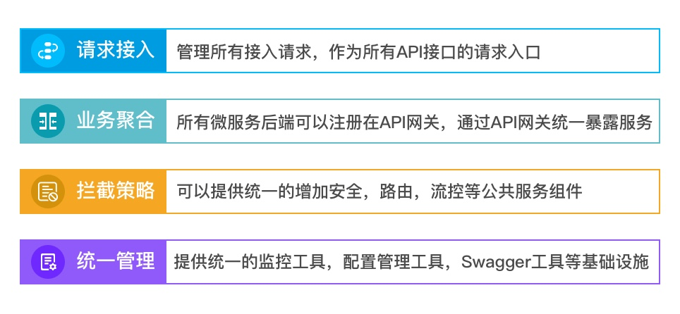
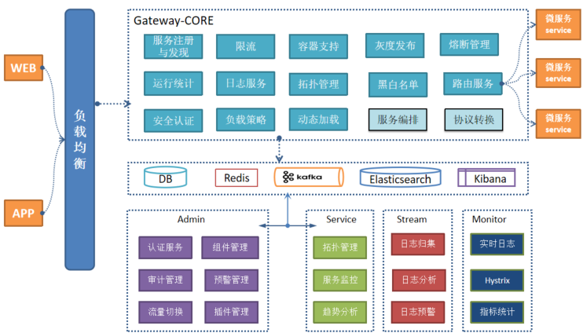
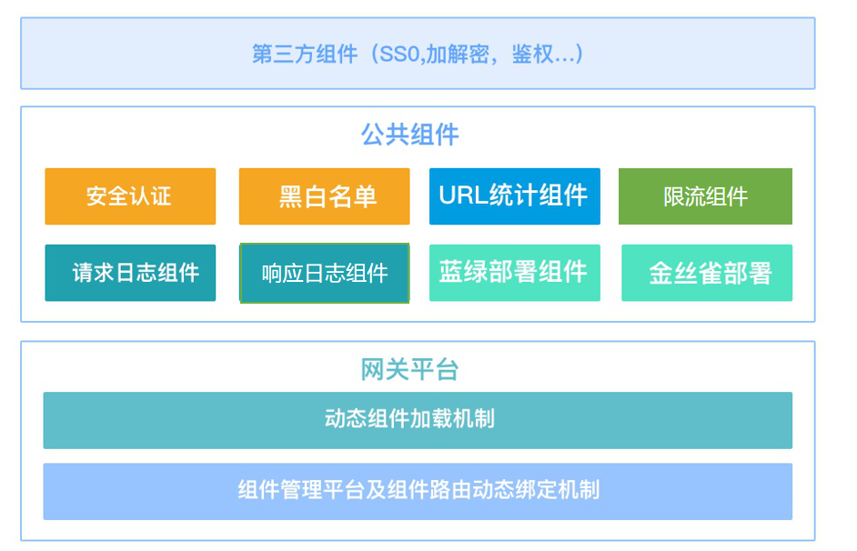
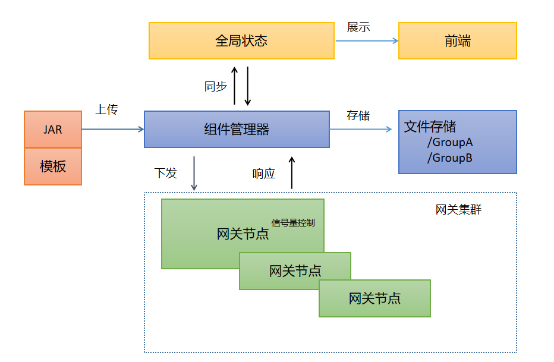
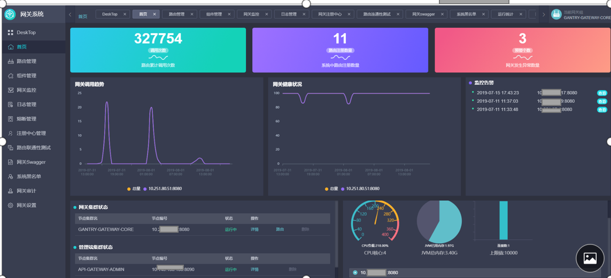
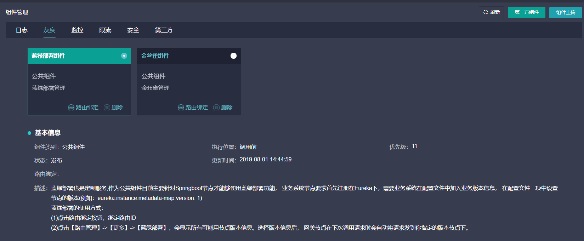
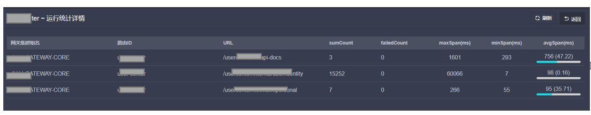

# SIA-GATEWAY| [English](README-en.md) 

[使用指南](docs/user_guide.md)  
[部署指南](docs/deploy_guide.md) 
[开发指南](docs/dev.md)  

一. 背景
---

&emsp;&emsp;架构，总是在不断的演进中...

&emsp;&emsp;把时间退回到二十年之前，当时企业级领域研发主要推崇的还是C/S模式，PB、Delphi这样的开发软件是企业应用开发的主流。随着时间不断的推移，标准化客户端模式的B/S架构开始渐渐流行了起来。初期，Web开发ASP还占据了不少优势，但JSP的预编译模式让性能有了很大的提升，因此JAVA变的越来越流行。

&emsp;&emsp;那时候的软件架构基本都是单体架构，系统之间往往不需要进行交互，这也导致数据孤岛和ETL工具的发展。随着企业应用越来多，相互的关系也越来密切。应用之间也迫切需要进行实时交互访问，大家发现，几乎所有语言的系统都能够解析XML语言，因此SOA的概念被提了出来，web service开始流行。之后为了适应更加灵活的业务需求，简洁和清晰的层次结构使得 JSON 成为理想的数据交换语言，在SOA架构中企业服务中线技术ESB暴露的集中式架构的劣势让开发者明白基于注册和发现的分布式架构才是解决问题的关键办法。由此，微服务架构逐渐流行起来. 在《微服务设计》中如何界定一个微服务，就是使用松耦合&高内聚原则，把因相同因素变化的事情聚集在一起，把因不同因素变化的事情区隔开来。

二. 微服务架构特性
---

&emsp;&emsp;微服务，其实是一种架构风格...

* 异构

&emsp;&emsp;微服务可以帮助我们轻松采用不同的技术，并且理解这些新技术的好处，尝试新技术通常伴随这风险。但对于微服务系统而言，总会存在一些地方让你可以尝试新技术，可以选择一个风险最小的服务采用新技术，即便出现问题也容易处理，这种可以快速采用新技术的能力对很多组织而言是非常有价值的。

* 弹性

&emsp;&emsp;微服务架构可以改进弹性，可以很好的处理服务不可用和功能降级问题。

* 扩展

&emsp;&emsp;庞大的单体服务只能作为一个整体进行扩展，即使系统中只有一小部分存在性能问题，也需要对整个服务进行扩展。如果使用较小的多个服务，则可以只队需要扩展的服务进行扩展，这样就可以把那些不需要扩展的服务运行在更小的，性能稍差的硬件上。

* 部署简单

&emsp;&emsp;在微服务架构中，各个服务的部署是独立的，这样就可以更快的对特定部分的代码进行部署。如果真的出了问题，也只会影响一个服务，并且容易快速回滚，这也意味着客户可以更快的使用我们开发的新功能。

* 灵活

&emsp;&emsp;在微服务架构中，系统会开放很多接口供外部使用。当情况发生改变时，可以使用不同的方式构建应用，而整体化的应用程序只能提供有一个非常粗粒度的接口供外部使用。把单体应用分解成多个微服务，可以达到可重用，可组合的目的。

&emsp;

三. 微服务与网关
---

* 下图是一个典型的微服务架构，仅供参考

&emsp;&emsp;

* 什么是微服务网关

微服务网关是微服务架构中的一个关键的角色，用来保护、增强和控制对于微服务的访问，微服务网关是一个处于应用程序或服务之前的系统，用来管理授权、访问控制和流量限制等，这样微服务就会被微服务网关保护起来，对所有的调用者透明。因此，隐藏在微服务网关后面的业务系统就可以更加专注于业务本身。

* 微服务网关的分类

常见的微服务网关根据使用特性大致被分成流量网关和业务网关。两种网关分别有不同关注点，下面是总结的两种网关类型特性：

* 微服务网关的作用

微服务网关作为连接服务的消费方和服务提供方的中间件系统，将各自的业务系统的演进和发展做了天然的隔离，使业务系统更加专注于业务服务本身，同时微服务网关还可以为服务提供和沉淀更多附加功能，下面是总结的微服务网关主要作用：

&emsp;

四， SIA-GateWay
---
&emsp;&emsp;SIA-GATEWAY 是基于SpringCloud微服务生态体系下开发的一个分布式微服务网关系统。具备简单易用、可视化、高可扩展、高可用性等特征，提供云原生、完整及成熟的接入服务解决方案。

## 关键特性

* 简单易用, 支持基于Docker容器的快速部署及交付。
* 兼容性良好, 兼容SpringBoot微服务及传统HTTP-URL的负载均衡及路由服务。
* 高可扩展性, 支持基于Java语言的第三方插件扩展特性及动态加载机制。
* 支持多租户，多用户角色下的网关拆分管理。
* 可视化管理，提供实时路由拓扑、网关集群拓扑展示功能。
* 服务治理，支持网关集群Dashboard、实时日志、历史日志查询、熔断管理、预警管理等功能。
* 多注册中心支持，提供分布式网关集群下对多注册中心集群的切换管理功能。
* 动态路由组件绑定机制，提供包括URL统计、日志、灰度发布、限流、安全等公共服务组件。

&emsp;&emsp;下图是SIA-GATEWAY的整体架构图，架构由CORE和 Admin Cluster组成，其中：
* CORE承载网关HTTP请求的主要服务节点，CORE节点可以根据所属的网关组信息自动注册到Admin管理端。
* Admin是网关集群的管理后台，由Admin、Service、Stream、Monitor等服务组成。

&emsp;&emsp;下图是网关的整体部署架构图：

面向业务系统的微服务网关
---

&emsp;&emsp;微服务网关系统是一个处于应用程序或服务（提供REST API接口服务）之前的中间件系统， 所以SIA-GateWay在建设初期做技术选型时就充分考虑到所使用的技术方案应该兼容后端代理业务系统所使用的技术栈和技术体系，所以我们使用了Netflix的ZUUL作为我们网关系统技术栈，单纯的脱离使用场景谈某一种网关功能如何强大的做法，后续都会给业务方的使用带来更多的麻烦。 更明确的说如果目前大部分业务系统采用的技术栈是JAVA系统， 那么不建议使用Nginx, Kong 或者OpenResty等网关系统， 这里主要是处于软件工程性方面考虑。举个例子，业务方需要将一个公共组件以Plugin 机制集成到微服务网关， 如果使用Lua脚本文件或者其他脚本语言，那么引入一种新的语言技术栈所带来的复杂度会给业务系统带来更多的不确定性，系统后期维护成本和运维的难度都会呈指数级的提升。

基于组件模块化的设计
---

&emsp;&emsp;微服务网关的一个很重要的作用就是可以将微服务的API聚合后提供一个统一的EntryPoint作为业务使用方的一个统一入口以及屏蔽和隐藏业务内部逻辑。下面是SIA-GateWay提供的公共组件类型及分类。
目前SIA-GateWay通过组件管理的机制实现了5个大类8个子类的公共服务组件供业务方使用， 其中提供的路由组件绑定机制可以让业务方灵活的决定是否要在运行时执行相关组件逻辑。

去中心化的网关架构设计
---

&emsp;&emsp;微服务架构的一个重要的特性就是去中心化的架构设计思路，SIA-GateWay在软件设计层面上增加了一个“网关组”的抽象概念，一个网关组对应就是一个独立的业务领域。网关组的概念也契合了微服务架构中的一些理念：业务系统依赖微服务网关提供明确清晰的服务边界；业务系统通过微服务网关对外暴露业务的标准服务接口。
从实现层面， SIA-GateWay充分利用并结合了容器自动化的部署技术，在解决最后一公里的问题上，将网关以云端容器资源的方式交付给不同业务方，通过共享网关SDK部署包的方式将网关的服务下沉到容器中实现和执行，从而在时间和空间上做到了系统的弹性和灵活交付。同时中心化的管理能力又给使用网关的具有不同权限的用户可以同时维护各自所属网关组下的网关节点带来了便利。

&emsp;&emsp;上图展示的是SIA-GateWay去中心化的网关架构。当然除了微服务网关模式， 目前下一代微服务架构ServiceMesh技术也是典型的去中心化架构，ServiceMesh是从SideCar边车模式演进而来，是一种通过将服务治理能力下沉到业务节点的方式，通过控制面（control plane）和数据面（data plane）的处理解耦分离实现服务通信更加快速，便捷，智能。

然而目前来看， 从技术上及各大公司的实践中，ServiceMesh在落地上还存在诸多复杂性及不可控性，这种模式会给运维带来极大的成本，如果贸然使用会给本就复杂的分布式系统带来更多的复杂和难度。所以从目前来讲，GateWay网关的模式在组织粒度上可以调整，在实现方式上更加简单可控，是目前的微服务架构中比较适合采用的模式。

网关如何保证高可用
---

&emsp;&emsp;作为一个微服务网关系统， 因为所有流量都会经过网关， 网关必须成为一个高可用的中间件服务，网关系统的稳定性及可用性直接决定了所用下游服务的稳定性。因此SIA-GateWay在架构设计上主要做了如下几点：
* 集群化

&emsp;&emsp;在生产环境中，所用网关节点至少保证有2个节点组成集群同时提供服务，目前SIA-GateWay在公司内部主要使用容器化部署， 避免单点故障。

* 健康检查

&emsp;&emsp;在容器环境下，SIA-GateWay会暴露一个HTTP健康检查接口，通过Kubernetes 的健康检查机制，定期检查HTTP访问是否可用， 如果不可用，利用Kubernetes 的服务编排能力可以做容器的切换；在Zstack环境下， 通过后台启动一个Crontab作为守护进程检查进程的状态，保证网关的稳定可用和进程重启机制。

* 备份机制

&emsp;&emsp;SIA-GateWay提供了一种备份网关机制，在Zstack上会启动一个备份网关API-GATEWAY-CORE，所有在容器环境（Kubernetes ）中启动的网关节点，都会将自己的路由信息同步到备份网关中，另外， 利用Nginx的高可用性和健康检查机制， 当Kubernetes 集群出现问题时所有容器流量无法响应时， 会将Nginx上的流量自动切换到API-GATEWAY-CORE备份节点。API-GATEWAY-CORE在工作时也会触发预警，提示目前有不可用的K8s网关节点。

提供机制而不是策略
---

&emsp;&emsp;Unix编程哲学里，一个重要的概念就是：“提到机制而不是策略”，通俗的讲“机制”就是接口， “策略”就是具体的实现。SIA-GateWay提供的组件集成能力正是基于这样的理念。
SIA-GateWay将架构的可扩展性作为重要的对外输出能力，第三方插件机制主要支持JAVA语言的Filter组件动态加载机制。Filter机制是JAVA工程师最为熟悉的标准组件，所以对于业务方集成自己的业务逻辑提供了极大的便利，第三方业务组件加载到网关平台大体有如下几个步骤：
* 根据SIA-GateWay提供的模板类及注解， 实现动态业务逻辑
* 将实现好的动态组件通过Maven打包。
* 在组件管理界面，通过组件上传按钮将组件上传到Admin-组件管理器。
* 组件管理器执行文件存储逻辑。
* 组件管理器执行组件下发操作，将组件分发到对应网关组。
* 网关节点通过ClassLoader反射解析组件并动态加载到内存。
* 网关节点通过异步信号量机制响应组件加载状态。
* 组件管理器同步插件Plugin状态。
下图是SIA-GateWay组件加载机制的执行逻辑图：

强化可视化和微服务治理能力
---

俗话说流水的架构， 铁打的监控， 任何架构都需要软件监控。微服务应用本身RPC的交互方式和带来了对监控系统了解系统运行状态的难题。SIA-GateWay对微服务监控主要做了如下方面增强：
*  全局的集群状态查看和容器状态DashBoard统计

*  实时的路由拓扑和网关拓扑调用关系及状态展示,实时的路由拓扑图如下：

*   网关集群拓扑管理界面，包含实时日志，实时Hystix监控，JVM配置等

*  可视化的组件管理界面：

*  日志回溯及查看，利用EKK架构实现日志

*  熔断管理的分类及错误Stacktrace查看

*  URL细粒度的监控统计功能（默认不打开，需要路由绑定监控组件）,包括URL的  
延迟统计，调用计数等指标。

## 相关文章：
+ [微服务网关如何实现对服务下线的实时感知](https://mp.weixin.qq.com/s/f1LHALI3avVfnHyHTj-vuA)

## 联系我们

* 邮件交流：sia.list@creditease.cn

* 提交issue:

* 微信交流：

    
